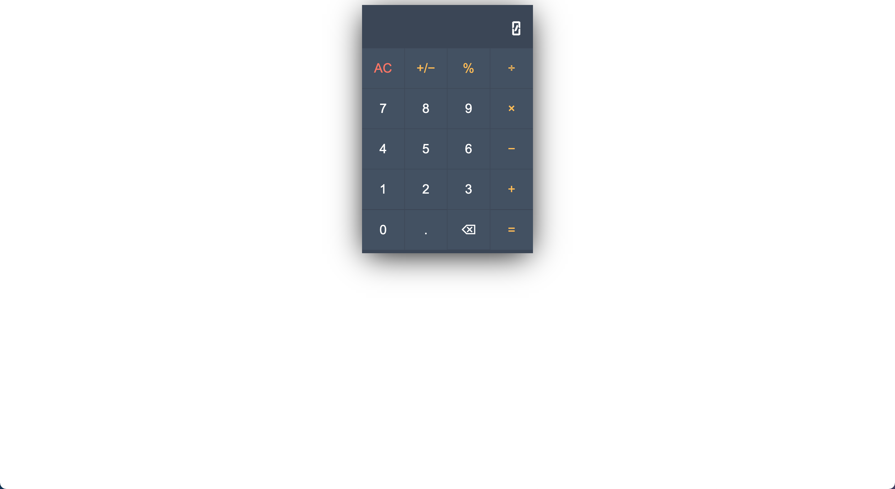

# Simple JavaScript Calculator

This is a basic calculator built using HTML, CSS, and JavaScript. The calculator allows users to perform simple arithmetic operations such as addition, subtraction, multiplication, and division. It also supports decimal input, percentage calculation, and toggling of positive/negative numbers.



## Features

- **Arithmetic Operations**: Addition, subtraction, multiplication, and division.
- **Decimal Input**: Allows input of decimal numbers for precise calculations.
- **Percentage Calculation**: Converts the current number to its percentage value.
- **Toggle Sign**: Changes the sign (positive/negative) of the displayed number.
- **Clear (AC)**: Clears all input and resets the calculator.
- **Backspace**: Deletes the last entered digit or decimal point.
- **Error Handling**: Displays "Math Error: Division by zero" when attempting to divide by zero.

## How to Use

1. **Clone the Repository**:
   ```bash
   git clone https://github.com/reduanmasud/odin-calculator.git
   ```

2. **Open `index.html` in a Web Browser**:
   - Simply double-click on `index.html` to open the calculator in your default web browser.

3. **Usage**:
   - Click on the calculator buttons to input numbers and perform operations.
   - Use the `AC` button to clear all input and start over.
   - Click the `=` button to calculate the result of the entered expression.

## Technologies Used

- **HTML**: Structure and layout.
- **CSS**: Styling and design.
- **JavaScript**: Logic and functionality.

## Calculator Logic

The calculator's logic is implemented using JavaScript functions for arithmetic operations (`sum`, `sub`, `prod`, `div`), event handling for button clicks (`addEventListener`), and DOM manipulation to update the display (`innerHTML`). It maintains state through variables (`operand`, `operand_2`, `operator`, `dot_flag`) to handle user input and perform calculations.

## Future Enhancements

- **Memory Functions**: Add memory operations like memory recall, store, and clear.
- **Scientific Functions**: Incorporate trigonometric and exponential functions.
- **Improved UI**: Enhance the calculator's appearance and responsiveness.

